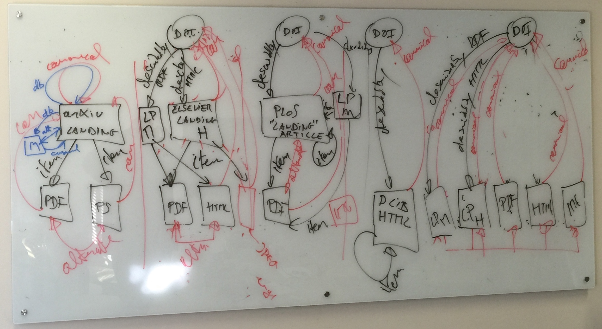

# Signposting the Scholarly Web

Simeon Warner's notes from discussions 2015-03-03, 2015-03-04 with 
Herbert Van de Sompel (LANL), 
Geoffrey Bilder (CrossRef), 
Joe Wass (CrossRef) and 
Karl Ward (CrossRef)
in Oxford, UK.

## Background

  * PID/splash-page pattern - Herbert's video created for FORCE2015 where he notes "I make no claims this is THE way to do it, rather it's just a quick stab at it" - <https://www.youtube.com/watch?v=deejMy4-zTU>
  * Blog post by Michael Nelson re HATEOAS that includes several further pointers - <http://ws-dl.blogspot.com/2013/11/2013-11-19-rest-hateoas-and-follow-your.html>
  * Web Linking RFC - <https://tools.ietf.org/html/rfc5988>
  * IANA link relation type registry - <http://www.iana.org/assignments/link-relations/link-relations.xhtml>
  * Erik Wilde's GitHub repo with link relation types - <https://github.com/dret/sedola/blob/master/MD/linkrels.md>
  * Memento as a versioning pattern - <http://mementoweb.org/guide/howto/>
  * Basic provenance: derivedFrom defined in - <https://tools.ietf.org/html/draft-hoffman-xml2rfc-15>
  * Requesting to "connect" resources: webmention defined in <http://indiewebcamp.com/webmention>
  * Categorizing resources: `type` defined in <http://tools.ietf.org/html/rfc6903>

## Pre-meeting thoughts

We are moving to a world with most scholarly information on the web and toward common use of identifiers for works/instances of both papers and data (DOI in particular), and for people (ORCID). There are initiatives in versioning and connection to independent archives (Memento), and in annotation (W3C OA and Hypothes.is). Work on the semantic web is shifting to a more practical focus on linked open data (including LDP and JSON-LD). A persistent problem is that there are very inconsistent linking practices and when a machine or user gets to a particular resource, it is often hard to work out _what_ the resource is, and what the _context_ is. There are several web standards that might help with this but they often solve only part of the problem, are little understood and inconsistently used. Can we work out patterns of linking, using HTTP Link headers in particular, that would help facilitate some key use case?

Note problems with seeing headers from JavaScript. JavaScript requests will simply follow redirects without seeing intermediate headers and most headers aren't visible at all unless the right CORS headers are present.

Would be great to have a document somewhat like "Cool URIs for the Semantic Web" that describes a set of patterns in straightforward terms. Should be driven by use cases. Need to get input and review. Need plan to update.

## Tuesday 2015-03-03

Most journal publishers have limited direct control over how their material is presented on the web. There are 2 major manuscript system providers, and a few access system vendors.

CrossRef developing metrics to help publishers understand the quality and utility of their metadata in CrossRef (e.g. author data, non-capitalized titles) and features their sites support (e.g. HEAD support). Herbert notes the importance of date of publication but Geoff points out that publishers sometimes don't know their dates at all accurately (have just "summer 2014 issue" for example). See Stefanie Haustein publication which studies relation of tweet times to official publication times. Some stats by publisher available via CrossRef API, e.g. <http://api.crossref.org/members?query=hindawi>.

Memento work has seen issues with JavaScript not being able to see Link headers. They use plugin to be able to see headers. DOI resolver has parameter no-redirect (not sure of name) so that one can more easily do HEAD to get headers on a request that would otherwise be redirected. JavaScript can only see headers if there are CORS headers (Access-Control-Expose-Headers: Link)

Side mention: can track number of DOIs with ORCID iD(s) via the CrossRef API can do <http://api.crossref.org/works?filter=has-orcid:true>. Currently 186k!

Demo of DOI use of Link header data: <http://crossref.github.io/doi-popup/>

DOI is a non-information resource and now does 303 as part of the conneg to splash page or other metadata. The DOI identifies a "citable work/instance" as different from a splash page or a PDF. Therefore, "describedby" is certainly correct for link from DOI to splash page (and inverse "describes" the other way). CrossRef adds Link headers for things like ORCID iDs. 

Suggestion is to use "canonical" as defined by <http://tools.ietf.org/html/rfc6596> to link from splash page back to DOI. The RFC is unclear about whether this is correct: some of the language explicitly suggests it for a 303, but other text says that the target should be a version that includes all the content of the subject(s) of the canonical link. Note that use of rel="canonical" to link from splash page to DOI or other non-information resource (back up a 303) is consistent with practice describes in ResourceSync.

Not in IANA but CrossRef would like to use rel="shortlink" (defined by Google at <https://code.google.com/p/shortlink/wiki/Specification>. Also described in <http://microformats.org/wiki/rel-shortlink>.

Example case of an article where the figures have DOIs of their own: figure <http://doi.org/10.1371/journal.pone.0118554.g001> is in article <http://doi.org/10.1371/journal.pone.0118554>.

Should we type the landing page with rel="type" using some vocabulary? Although it does seem special we don't yet have a use case that requires its identification. Any typing should be motivated by an understood need.

## Use Cases

1. Citation - follow rel="canonical" and, if necessary rel="collection", links that would usually get up to a DOI or similar identifier for the citable object (work or expression).
*Example story:* A user pastes a splash page URI into a citation management system, how can the system understand that there is a DOI for this item and offer the option to cite that instead so that the resulting is more robust and more likely to be associated with the work in question?

2. Altmetrics, annotations - follow rel="canonical" and rel="collection" links to DOI or similar. Same as #1?

3. Preservation - Use case like LOCKSS is the need to answer the question: What are all the components of this work that should be preserved? Follow all rel="describedby" and rel="item" links (potentially multiple levels perhaps through describedby and item). This could also be done with ORE aggregates so perhaps include ore:aggregates links too.

4. Crawler with preferred formats - look for rel="alternate" links to preferred formats and understand that content in different formats is equivalent. (Note that alternate in intended to be transitive per <http://www.w3.org/TR/html5/links.html#rel-alternate>).

## Wednesaday 2015-03-04

Some publishers register a URI with CrossRef that then goes through a number of redirects to get to the splash page. This will mean that if CrossRef adds a rel="describedby" link then it will be to an intermediate node rather than directly to the splash page. This seems OK provided there are simple and functional redirects to the splash page. In some cases the intermediate URIs require support for JavaScript and/or cookies even to get a client to the splash page. This is broken and would likely stop an automated agent from getting from a DOI to the splash page.

*SSRN:* Normal case in SSRN is for there to be a DOI that resolves to the splash page, e.g. <http://papers.ssrn.com/sol3/papers.cfm?abstract_id=1968579> has DOI <http://doi.org/10.2139/ssrn.1968579>. These cases are just like the standard publisher case. There are some articles in SSRN that do not have DOIs, e.g. <http://papers.ssrn.com/sol3/papers.cfm?abstract_id=2572918>.

*Multiple resolution:* There are cases in CrossRef that support multiple resolution, e.g. <http://doi.org/10.1525/bio.2009.59.5.9> which does 303 to an HTML choice page <http://mr.crossref.org/iPage?doi=10.1525%2Fbio.2009.59.5.9> which has links to two options <http://www.jstor.org/stable/25502450> and <http://www.bioone.org/doi/full/10.1525/bio.2009.59.5.9> which are both landing pages in the respective systems.

## Actions

  * Simeon to put up some notes and graphs on github, and share
  * CrossRef to work on experiment on labs.crossref.org
  * Get feedback from community on possible patterns
