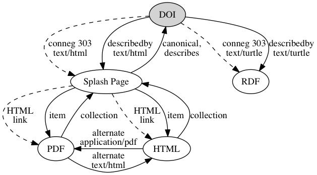
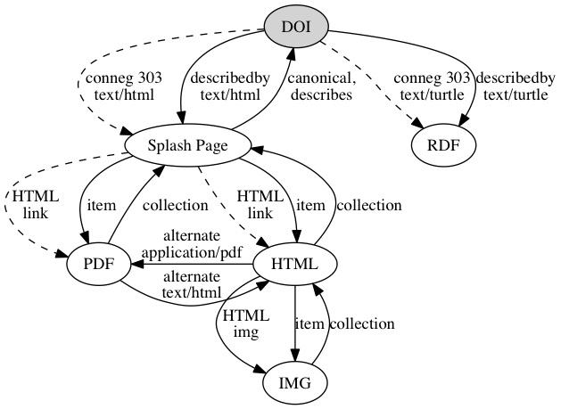
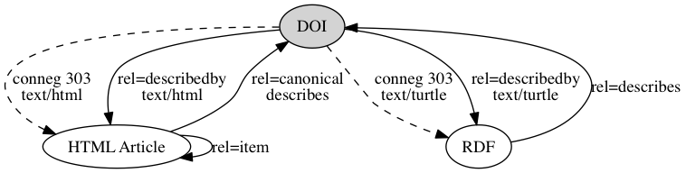
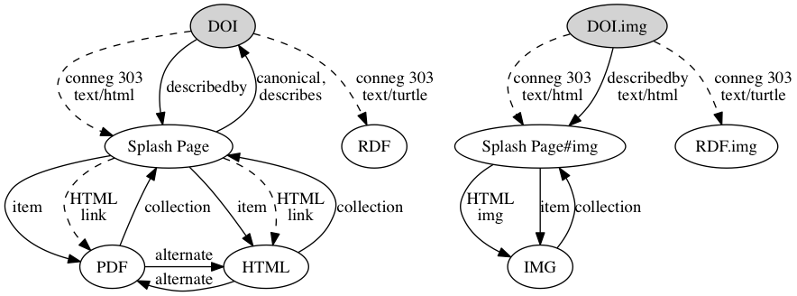
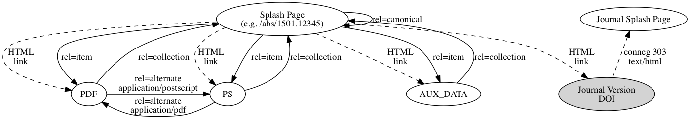
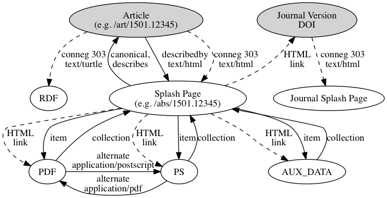
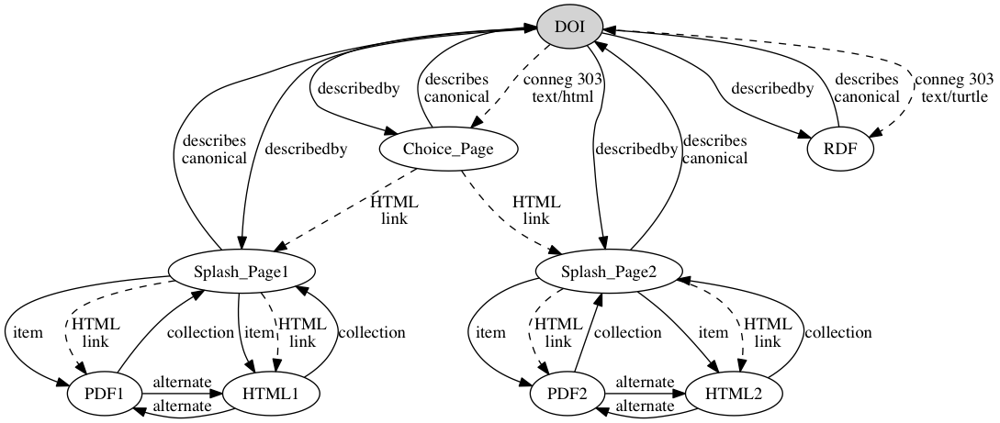

# Scenarios

This page is a set of linking scenarios for [signposting the scholarly web](README.md).

## Generic DOI for journal article with PDF and HTML

## Generic DOI for journal article with PDF and HTML, where the HTML version has an included image

Q. Should the image be part of the `collection` from the splash page, or a sub-`collection` as shown?

## DLib article example, no splash page

[DLib](http://dlib.org/) is unusual in that articles are HTML and there is no separate splash or landing page.
 

## PLOS article example with separately identifier figure

## arXiv without an abstract article item (as at present)

## arXiv with an abstract article item (planned)

## DOI resolution to multiple sources

In some case a DOI resolves to an HTML choice page instead of to the splash page on a single publishers' website. When the user chooses which publisher to go to, they get to a splash page as usual.

